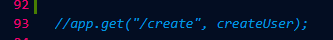

# My Personal Website

This project was my first journey in the Web dev world.
I mostly used native javascript and css to maintain my knowlege,
the naming of the css classes are not good but I'll fix it over time.
 
> [!CAUTION]
> The reason that the EJS is the majority of written code in this project is using complex SVGs.

## Packages That I Used

* Express
* EJS
* Joi
* Mongoose
* Express-session
* bcrypt
* env
* Connent-Mongo
* and more ...

## How to Run the Code:

1. Run the console command, in the project directory run this command:
```console
npm i
```
or
```console
npm install
```
2. make file and name it .env
3. inside the env file add these paramater
```env
PORT=3000
DB_URL=mongodb://127.0.0.1:27017/Database
SESSION_SECRET=ASecret
ADMIN_USERNAME=yourUsername
ADMIN_PASSWORD=yourPassword
ADMIN_EMAIL=yourEmail
```
4. in the index.js uncomment the create route in the line 93

5. run this command in your console:
```console
node index.js
```
Or 
```console
npm install -g nodemon
nodemon index.js
```
6. go to the http://localhost:3000/create to create admin username and password

it's done now you have access to the admin section.
